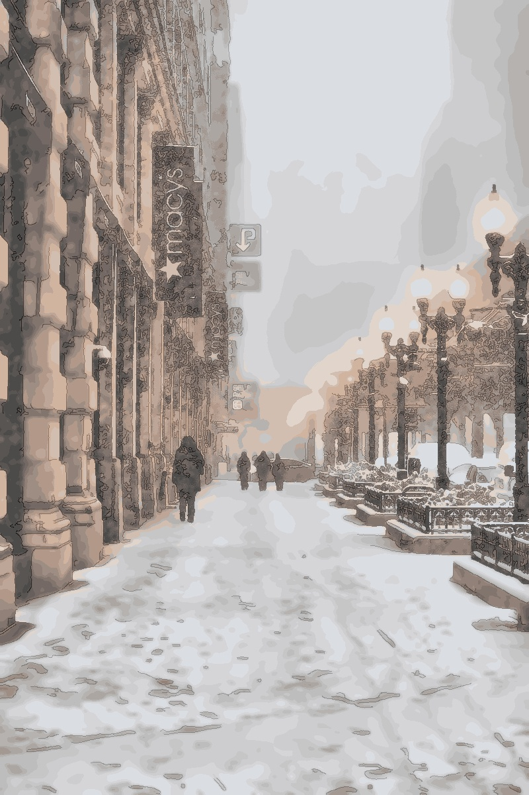
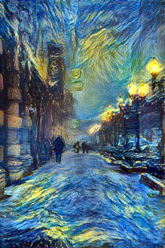

# Image Processing Web Application

A Django-based web application for processing and enhancing images. This application allows users to upload images, apply various filters and enhancements, and download the processed images. Additionally, it includes a **Style Transfer** feature to apply artistic styles to images.

---

## Features

### **Image Enhancements:**
- Brightness adjustment
- Contrast adjustment
- Saturation adjustment
- Denoising
- Sharpening
- Smoothing
- Color balancing
- Auto-optimization

### **Filters:**
- Sepia
- Pencil sketch
- Oil painting
- Black & White
- Cartoonization
- HDR effect
- DSLR-like blur
- Glitch effect
- Pixelation

### **Style Transfer:**
- Transform content images with the style of famous artworks or custom images.
- Supports artistic styles like Van Gogh, Frida Kahlo, and more.
- Outputs high-quality styled images for download.

### Additional Features:
- Responsive UI for ease of use.
- Real-time preview and download of processed images.

---

## Getting Started

### Prerequisites

- Python 3.8 or higher
- Django 5.1.4
- OpenCV (cv2)
- NumPy
- Scikit-learn
- PyTorch (for Style Transfer)

### Installation

1. Clone this repository:
   ```bash
   git clone <repository-url>
   ```
2. Navigate to the project directory:
   ```bash
   cd image_processor
   ```
3. Install the required Python libraries:
   ```bash
   pip install -r requirements.txt
   ```
4. Download the required PyTorch model for style transfer:
   ```bash
   # Example: Download the VGG-19 model used for neural style transfer
   wget https://download.pytorch.org/models/vgg19-d01eb7cb.pth -P models/
   ```
5. Apply database migrations:
   ```bash
   python manage.py migrate
   ```
6. Start the Django development server:
   ```bash
   python manage.py runserver
   ```
7. Open the app in your browser:
   ```
   http://127.0.0.1:8000
   ```

---

## File Structure

- **image_app/**: Contains the core application code, including:
  - `views.py`: Handles requests and processes images.
  - `urls.py`: Maps routes to views.
  - `templates/`: HTML files for the frontend.
  - `static/`: CSS, JS, and other static assets.

- **utils/**: Utility functions for image processing.
  - `image_enhancements.py`: Enhances image quality.
  - `image_filters.py`: Applies various image filters.
  - `image_processor.py`: Processes the uploaded image with selected options.
  - `utilities.py`: Helper functions for resizing, quantization, and more.

- **neural-style-pt/**: Contains the neural style transfer script and model.
  - `neural_style.py`: Main script for style transfer.
  - `CaffeLoader.py`: Helper for loading the VGG-19 model.

- **media/uploads/**: Stores uploaded content and style images.
- **media/results/**: Stores processed and enhanced images.
- **media/style_results/**: Stores styled images generated by the style transfer.

- **settings.py**: Django project settings.

---

## Usage

### **Image Enhancements**
1. **Upload an Image**: Select an image file to upload.
2. **Adjust Parameters**:
   - Use sliders to adjust brightness, contrast, and saturation.
   - Select filters or enhancements from the checkboxes.
3. **Process the Image**: Click the "Process" button to apply your settings.
4. **Download**: Once processed, the image can be previewed and downloaded.

### **Style Transfer**
1. **Upload Content and Style Images**:
   - Choose a content image (the image to be transformed).
   - Choose a style image (the artistic style to apply).
2. **Apply Style**:
   - Click the "Apply Style" button to start the transformation.
   - Wait for the process to complete.
3. **Preview and Download**:
   - View the styled image once processing is complete.
   - Click "Download Image" to save it locally.

---

## Example Outputs

<table>
  <tr>
    <th>Input Image</th>
    <th>Processed Image</th>
    <th>Style Transfer Result</th>
  </tr>
  <tr>
    <td></td>
    <td></td>
    <td></td>
  </tr>
</table>

---

## Dependencies for Style Transfer

- **VGG-19 Model**: Pre-trained neural network for feature extraction.
- **PyTorch**: Framework for neural network processing.
- **neural-style-pt**: Style transfer script from [ProGamerGov](https://github.com/ProGamerGov/neural-style-pt).

---

## Author

**Zesheng Wang**  
Date: December 2024

---

### **Acknowledgments**

- The style transfer functionality is powered by [neural-style-pt](https://github.com/ProGamerGov/neural-style-pt).
- Special thanks to the contributors of open-source libraries and frameworks used in this project.