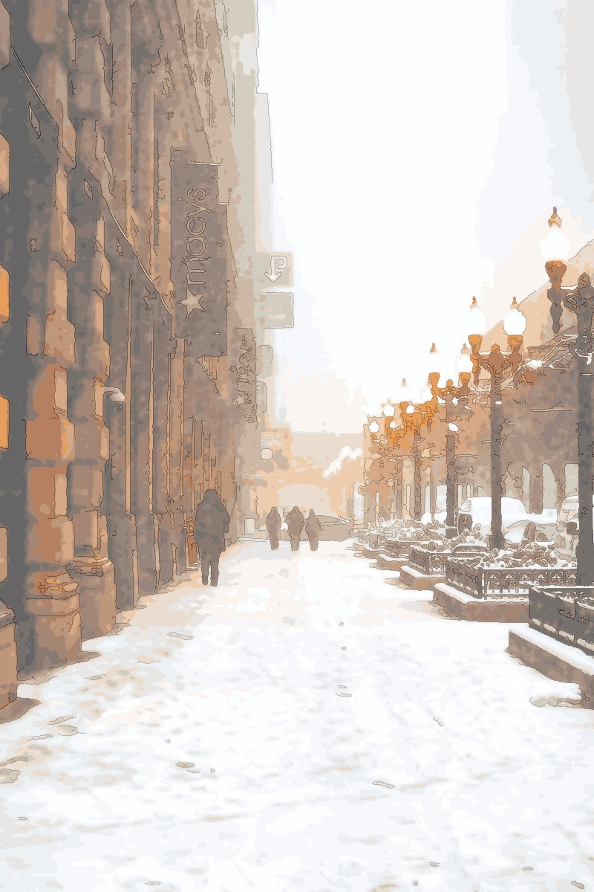

# Image Processing Web Application

A Django-based web application for processing and enhancing images. This application allows users to upload images, apply various filters and enhancements, and download the processed images.

---

## Features

- **Image Enhancements:**
  - Brightness adjustment
  - Contrast adjustment
  - Saturation adjustment
  - Denoising
  - Sharpening
  - Smoothing
  - Color balancing
  - Auto-optimization

- **Filters:**
  - Sepia
  - Pencil sketch
  - Oil painting
  - Black & White
  - Cartoonization
  - HDR effect
  - DSLR-like blur
  - Glitch effect
  - Pixelation

- Responsive UI for ease of use.
- Real-time preview and download of processed images.

---

## Getting Started

### Prerequisites

- Python 3.8 or higher
- Django 5.1.4
- OpenCV (cv2)
- NumPy
- Scikit-learn

### Installation

1. Clone this repository:
   ```bash
   git clone <repository-url>
   ```
2. Navigate to the project directory:
   ```bash
   cd image_processor
   ```
3. Install the required Python libraries:
   ```bash
   pip install -r requirements.txt
   ```
4. Apply database migrations:
   ```bash
   python manage.py migrate
   ```
5. Start the Django development server:
   ```bash
   python manage.py runserver
   ```
6. Open the app in your browser:
   ```
   http://127.0.0.1:8000
   ```

---

## File Structure

- **image_app/**: Contains the core application code, including:
  - `views.py`: Handles requests and processes images.
  - `urls.py`: Maps routes to views.
  - `templates/`: HTML files for the frontend.
  - `static/`: CSS, JS, and other static assets.

- **utils/**: Utility functions for image processing.
  - `image_enhancements.py`: Enhances image quality.
  - `image_filters.py`: Applies various image filters.
  - `image_processor.py`: Processes the uploaded image with selected options.
  - `utilities.py`: Helper functions for resizing, quantization, and more.

- **templates/index.html**: Main frontend template.

- **settings.py**: Django project settings.

---

## Usage

1. **Upload an Image**: Select an image file to upload.
2. **Adjust Parameters**:
   - Use sliders to adjust brightness, contrast, and saturation.
   - Select filters or enhancements from the checkboxes.
3. **Process the Image**: Click the "Process" button to apply your settings.
4. **Download**: Once processed, the image can be previewed and downloaded.

---

## Example Outputs

| Input Image | Processed Image |
|-------------|-----------------|
|  |  |

---

## Author

**Zesheng Wang**  
Date: December 2024
